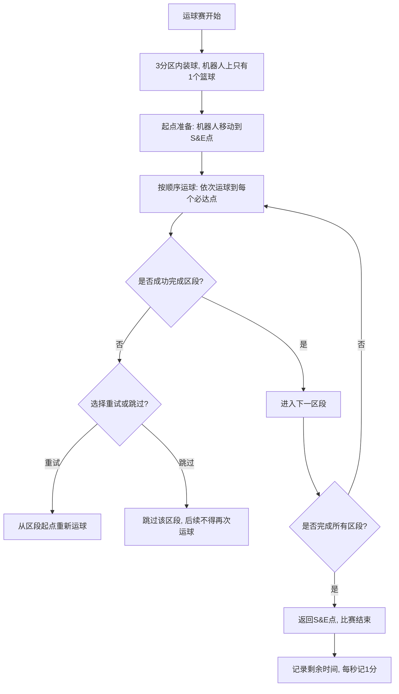
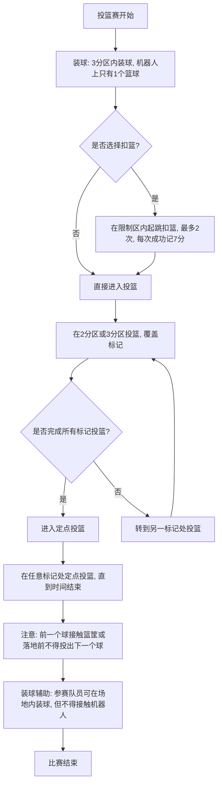

## 上午

- 广工框架学习使用
- 仿真控制joint速度/位置
  <!-- ros_control 控制示例 -->
  [控制示例视频](https://docimg5.docs.qq.com/image/AgAABsy7q125VT50kBxPsY19A3PBcvZM.gif?w=7248&h=2160&type=image/gif)
  <!--  -->

---

## 下午

- 梳理技能挑战赛流程

### 运球赛流程：

### 投篮赛流程：

<!--  -->

<mermaidSVG />
<!-- tried to embed an .astro to embed a mermaidSVG  .... -->

> ## 框架移植思考 (TODO)
>
> - 底盘仿真实践
> - 一些常用的电机导入？
> - **URDF的制作**？
